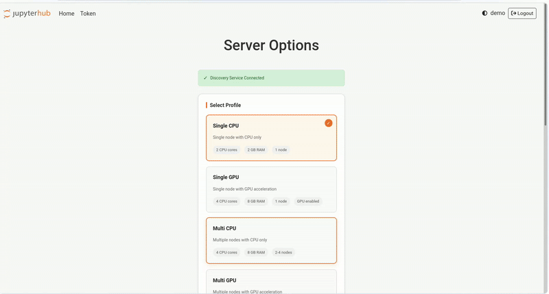

# JupyterHub JEG Cluster

This final project implements a distributed resource management system using Docker containers and JupyterLab. It allows multiple users to access GPU and CPU resources dynamically across multiple nodes through JupyterHub, a custom Discovery API, and Jupyter Enterprise Gateway integration.

JupyterHub serves as the main frontend interface, customized to allow users to select computing profiles and nodes. It integrates with the Discovery Service to choose the most optimal node based on current load and availability, and delegates kernel execution to Jupyter Enterprise Gateway (JEG), which launches kernels on the selected remote nodes.

## Project Structure

```bash
├── jupyterlab/               # Jupyter
│   ├── hub/                  # JupyterHub Config
│   ├── jeg/                  # Jupyter Enterprise Gateway Config
│   ├── benchmark/            # Performance testing (Locust)
│   ├── monitoring/           # Monitoring (Grafana, Prometheus)
│   └── docker-compose.yml    # Services orchestration
├── service-agent/            # Agent service
│   ├── agent.py
│   ├── Dockerfile
│   └── requirements.txt
├── service-discovery/        # API Service Discovery
│   ├── app.py, config.py, ...
│   ├── docker-compose.yml    # Services orchestration (Flask API, PostgreSQL & Redis)
│   ├── redis.conf, init.sql, ...
```

## Requirements

- Python 3.10, 3.11
- Docker and Docker Compose
- NVIDIA Driver & nvidia-container-toolkit (for GPU access)
- 2 or more nodes in a local network (1 node as control node)

Demo:



References:

- [jupyterhub/jupyterhub](https://github.com/jupyterhub/jupyterhub)
- [jupyter-server/enterprise_gateway](https://github.com/jupyter-server/enterprise_gateway)